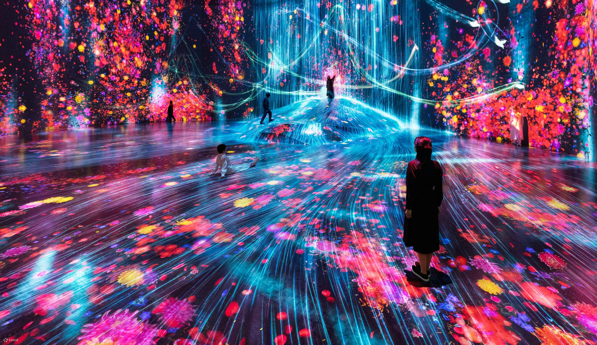

# PEC3: Visionando el futuro con las gafas de Manovich 

Autor: Andrea Almazán Gamero

## Introducción

El concepto de hibridación de medios según Lev Manovich es central para entender cómo el software y la tecnología digital están transformando la cultura y las artes. La hibridación de medios, en este contexto, hace referencia a la combinación y convergencia de diferentes disciplinas, medios y tecnologías para crear nuevas formas de expresión y experiencias. Manovich en su libro *El software toma el mando* (2014) argumenta que esta hibridación es posible y promovida por la digitalización y el uso del software como una herramienta unificadora. El software permite manipular y combinar diferentes tipos de contenido como texto, imagen, audio, video o animación de maneras que no eran posibles antes de la era digital (Manovich, 2014). Dos ejemplos notables de esta hibridación de medios en la era digital son Hatsune Miku y el colectivo artístico teamLab. Mientras Hatsune Miku personifica la fusión de la música, la animación y la inteligencia artificial, teamLab ejemplifica la integración de arte, tecnología y naturaleza para crear experiencias inmersivas. Este ensayo explorará cómo estos dos fenómenos representan la hibridación en el contexto contemporáneo y cómo representan el impacto transformador del software en las artes y la cultura.

## Re-descubriendo la hibridacion: Hatsune Miku.

  

 

Hatsune Miku es un avatar digital y una cantante virtual creada por Crypton Future Media utilizando el software de síntesis de voz Vocaloid desarrollado por Yamaha. Desde su debut en 2007, Hatsune Miku se ha convertido en un ícono global, no solo en la industria musical sino también en la cultura popular. La esencia de Hatsune Miku radica en su naturaleza híbrida, combinando la tecnología de síntesis de voz, la animación 3D y la participación activa de una comunidad global de productores y fans. (Navarro, 2023)

El fenómeno de Hatsune Miku comienza con su voz sintética, que se basa en muestras de la voz de la actriz japonesa Saki Fujita. Esta tecnología permite a los usuarios crear canciones originales, utilizando la voz de Miku como un instrumento. La accesibilidad del software ha democratizado la producción musical, permitiendo que productores y fans no sean meros consumidores, sino participantes activos en la creación de contenido (Shiba Tomonori, 2023). La comunidad global de Miku contribuye a un ciclo continuo de producción y retroalimentación, esta colaboración masiva no solo difumina las líneas entre el creador y el consumidor, sino que ejemplifica la hibridación de medios de la tecnología y el arte mediante la participación colaborativa.

Esta participación de la comunidad no solo permite que los fans sean meros consumidores de contenido, sino que también lo crean y lo comparten, generando este ecosistema colaborativo que da lugar a un nuevo modelo de producción cultural, donde el software y la tecnología permiten una integración sin precedentes de voces y talentos diversos.

Visualmente, Hatsune Miku es representada como una adolescente de cabello turquesa, diseñada por el artista Kei Garou. Su imagen se ha vuelto icónica, apareciendo en conciertos en vivo como un holograma 3D (Navarro, 2023). Estos conciertos son experiencias híbridas en sí mismas, fusionando la música en vivo, la animación y la tecnología de proyección holográfica para crear actuaciones que desafían las convenciones tradicionales de los conciertos. Los asistentes no solo escuchan la música, sino que también experimentan una presencia digital interactiva que trasciende la realidad física, creando experiencias multisensoriales que difuminan las líneas entre diferentes formas de arte y entretenimiento.

  

 
Concierto de Hatsune Miku: https://www.youtube.com/watch?v=jhl5afLEKdo

## Re-descubriendo la hibridacion: TeamLab.

  

 

TeamLab es un colectivo artístico interdisciplinario fundado en Tokio en 2001, conocido por sus instalaciones de arte digital que combinan proyecciones, luces LED, espejos y sensores para crear entornos envolventes (TeamLab, 2024). La obra de teamLab representa una hibridación de arte, tecnología y naturaleza, donde cada elemento se integra para formar una experiencia inmersiva y participativa.

Las instalaciones de teamLab son espacios donde los visitantes se convierten en participantes activos, interactuando con las obras de arte que responden a sus movimientos y acciones. Esta interactividad es posible gracias a la tecnología avanzada, incluidos sensores de movimiento y software de visualización en tiempo real. Las obras de teamLab, como *teamLab Borderless* y *teamLab Planets en Tokio*, ejemplifican cómo la tecnología puede transformar el arte en una experiencia dinámica y mutable (Metrópolis, 2019).

Uno de los aspectos más destacados del trabajo de teamLab es su enfoque en la naturaleza y los elementos orgánicos. Muchas de sus instalaciones se inspiran en fenómenos naturales como el agua, las flores y los animales. Sin embargo, estas representaciones no son simples reproducciones; están digitalmente manipuladas y reimaginadas, creando una fusión entre lo natural y lo artificial. Por ejemplo, en la instalación *Forest of Resonating Lamps*, las lámparas LED responden al movimiento de los visitantes, creando una coreografía luminosa que simula un ecosistema vivo (Japan National Tourism Organization, 2023).

El concepto de hibridación en teamLab también se manifiesta en su integración de diferentes disciplinas artísticas. El colectivo está compuesto por artistas, programadores, ingenieros, matemáticos y otros especialistas que colaboran para crear obras de arte complejas y multifacéticas (TeamLab, 2024). Esta colaboración interdisciplinaria es un claro ejemplo de hibridación de medios que permite que cada instalación sea una amalgama de creatividad y tecnología, donde el arte digital se convierte en una experiencia sensorial completa.

La experiencia inmersiva es otro elemento clave de la hibridación de medios en el trabajo de teamLab. Las instalaciones están diseñadas para sumergir a los visitantes en un entorno tridimensional donde los límites entre el espectador y la obra de arte se desdibujan. Esta inmersión se logra mediante el uso de tecnología avanzada y diseño espacial, creando un flujo continuo de imágenes y sonidos que envuelven a los participantes, creando una experiencia sensorial total (Metrópolis, 2019).

  

 
Exposición teamLab: https://www.youtube.com/watch?v=nDlav2FTBmQ

## Conclusión 

Tanto Hatsune Miku como teamLab representan ejemplos destacados de hibridación en el arte y la cultura contemporáneos, tal como se explora en *El software toma el mando* de Lev Manovich (2014). Hatsune Miku fusiona música, tecnología y participación comunitaria para crear una experiencia musical única y colaborativa. Por otro lado, teamLab integra arte, tecnología y naturaleza para diseñar instalaciones inmersivas y dinámicas que transforman la percepción del espacio y la interacción artística. Ambos fenómenos demuestran cómo la hibridación y la tecnología digital están reconfigurando las fronteras del arte, permitiendo nuevas formas de creación y participación que antes eran inimaginables. En este contexto, el software no solo toma el mando, sino que también abre nuevas posibilidades para la expresión y la experiencia artística en el siglo XXI.

### Referencias y Bibliografía

* Manovich, Lev. (2013). *El Software toma el mando*. Barcelona: Editorial UOC.
* Navarro, C. (2023). *Hatsune Miku, un fenómeno idol virtual*. CSEU La Salle. 
  Disponible en: https://www.lasallecentrouniversitario.es/hatsune-miku/
* Shiba Tomonori (2023) *Hatsune Miku: la diva electrónica que trajo la revolución musical del siglo XXI*. nippon.com.
  Disponible en: https://www.nippon.com/es/japan-topics/g01038/
* TeamLab. (2024). *About us*. TeamLab. Disponible en: https://www.teamlab.art/about/
* Metrópolis. (2019). *TeamLab.* RTVE.es.
  Disponible en: https://www.rtve.es/television/20190514/teamlab/1934327.shtml
* Japan National Tourism Organization. (2023). *EPSON TeamLab Borderless: MORI Building DIGITAL ART MUSEUM.*
  Disponible en: https://www.japan.travel/es/spot/2035/

----

Licencia: Material Creative Commons desarrollado bajo licencia CC BY-SA 4.0. Imágenes CC BY [Tubik studio](https://blog.tubikstudio.com/how-to-create-original-flat-illustrations-designers-tips/) 
